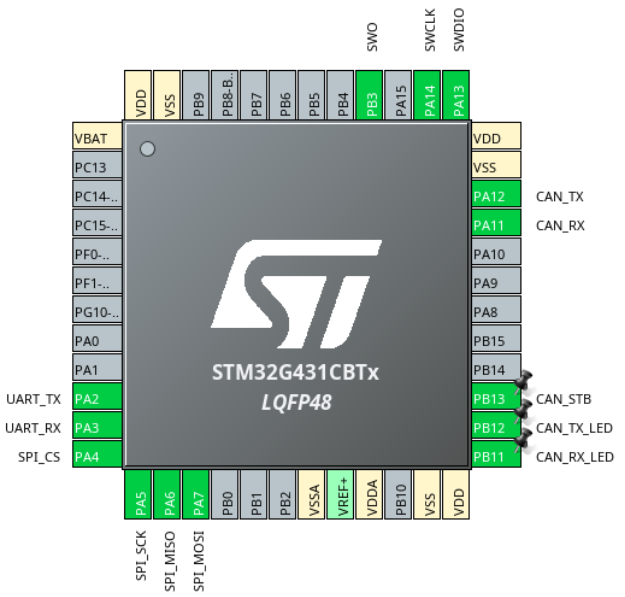

Git Branch: ABSENC-27

Link to Schematic:

Link to Layout: 

### Purpose
The purpose of the absolute encoder board is to be able to sense the position of components on our rover. In 2025-2026, we used two on joint DE in order to get the pitch and roll of the end effector. The motivation of doing the board in house was to allow for more control of how it interfaces with the rover and to be able to send the sensor information over CAN. 

### Stats
Size:

Nominal Current:

Max Current:

### Requirements
- The board must be able to fit in a 1.7x1.7 inch square
- The board must be able to be mounted
-  The sensor needs to be in the center of the board, be free of nearby components, and be the tallest part on that side of the board. Most likely this means it must be mounted on the back
- The MCU needs to be able to communicate with the sensor via the sensor’s protocol and communicate with the rest of the rover with CAN
- It must be powered by 5V
- All headers must be horizontal and on the same side

### Components 
MCU: STM32G431CBT6
[datasheet](https://www.st.com/resource/en/datasheet/stm32g431c6.pdf)

CAN FD Transceiver: TCAN1044VDRQ1
[datasheet](https://www.ti.com/lit/ds/symlink/tcan1044-q1.pdf?ts=1752649566659)

Absolute Encoder: AS5047U
[datasheet](https://www.mouser.com/datasheet/2/588/AS5047U_DS000637_1-00-1578405.pdf)

### IOC
Last year's IOC

### Interfaces
The main interface is with Robotic Arm (RA). It is mounted on joint DE. 
T

It also must interface with ESW for the code.

Changes From Previous Year
The dimensions were changed from 1.5x1.5 inches to 1.7x1.7, but the headers are now all on one side and horizontal. The mounted hole locations were also changed. 

Changes To Make Next Year
None Yet

